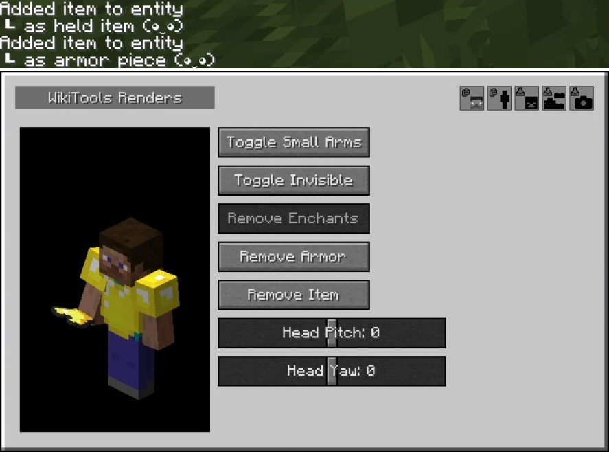
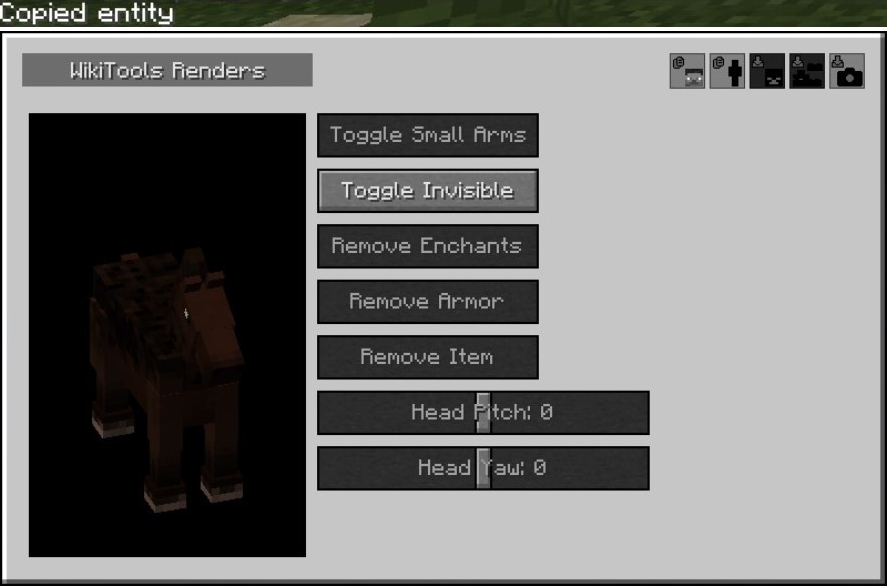
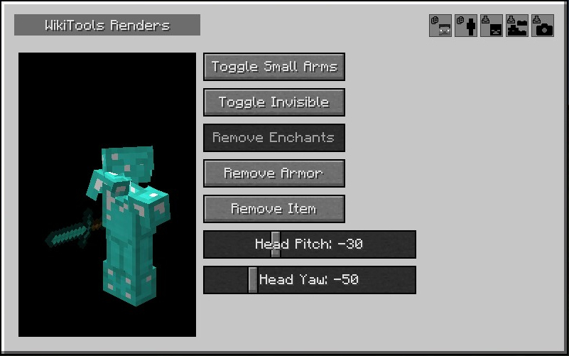
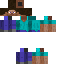
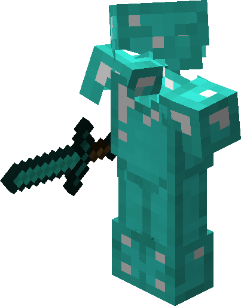

> [!IMPORTANT]
> This repository has been archived and the mod is no longer in development. For a similar, more feature-rich tool for the latest _Minecraft_ version, see [WikiRenderer](https://github.com/skyblock-wiki/WikiRenderer).

# WikiTools Renders 1.8.9

WikiTools Renders is a Minecraft mod that performs rendering tasks to support the workflow of wikis of Minecraft servers. The supported platform is _Minecraft 1.8.9_ with _Forge_.

This mod focuses on rendering tasks. There is a separate mod, [WikiTools 1.8.9](https://github.com/skyblock-wiki/wikitools-1.8.9), for non-rendering tasks.

## Installation

- Install Minecraft 1.8.9
- Install [Forge](https://files.minecraftforge.net/net/minecraftforge/forge/index_1.8.9.html)
- Install mods for Forge:
  - WikiTools Renders (see [Releases])

## Features

#### Add Item To Entity

When used on a hovered-over item in the inventory or a container screen, copy the item to the current entity in the Render Entity GUI.

**Key**: (Same as Copy Entity)

Available Behaviors:
- Default: Copies as held item of the current entity.
- Shift+Key: Copies as an armor piece of the current entity. In addition to standard armor pieces, blocks can be copied as a helmet piece.

#### Copy Entity

Copy the entity you are looking at to the Render Entity GUI. Armors and held items will automatically go onto the entity.

**Key**: M

#### Mod Update Checker

Check for new WikiTools release on GitHub and send an update reminder message.

#### Open Render Entity GUI

Launch the Render Entity GUI.

**Key**: K

#### Render Entity GUI

A menu to make simple renders of Minecraft entities.

Entity Modifiers:
- Toggle Small Arms
- Toggle Invisible
- Remove Enchants
- Remove Armor
- Remove Held Item
- Head Pitch
- Head Yaw

Entity Setters:
- Set Skin To Steve
- Copy Self (including the armors and held items on you)

Render Actions:  

- Download Head (png 72x72px)  
  
- Download Skin  
  
- Save Entity Image (png with the longer side of 512px)  
  

Make sure that the Minecraft window size is large enough (ideally fullscreen) when using Save Entity Image. A small window size can result in a partially cropped rendering.

## License

WikiTools Renders 1.8.9 is licensed under [LGPL-3.0-or-later](./LICENSE), except for FrameBufferHelper.java, which is All Rights Reserved by [Michael (mikuhl-dev)](https://github.com/mikuhl-dev).

## Other Pages

- [Attribution](./ATTRIBUTION.md)
- [Changelog](./CHANGELOG.md)
- [Contributing](./CONTRIBUTING.md)

[Releases]: https://github.com/skyblock-wiki/wikitools-renders-1.8.9/releases
